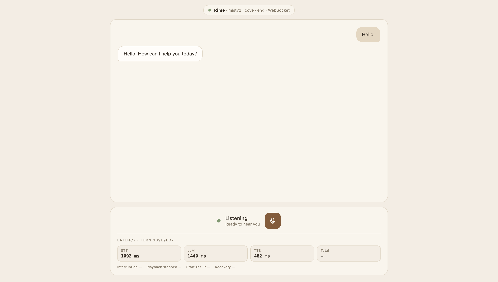
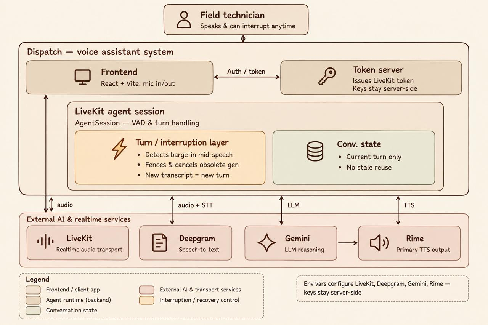

# Dispatch — Hands-Free Field Technician Voice Assistant

Dispatch is a full-duplex, hands-free AI voice assistant designed for field technicians. It combines real-time speech recognition, Gemini reasoning, streaming Rime speech synthesis, LiveKit audio transport, and generation-based interruption handling.

The core focus is **low-latency voice interaction and safe recovery when the user interrupts an ongoing response or operation**.

---

## Demo View



The web application provides:

- Real-time microphone input through LiveKit/WebRTC
- Live user and assistant transcripts
- Listening, Thinking, and Speaking states
- Microphone controls
- Provider and voice information
- Turn-level latency metrics
- Interruption and playback telemetry

---

## Architecture



```text
Field Technician
       │
       ▼
React + Vite Frontend
       │
       │ WebRTC Audio
       ▼
LiveKit Room
       │
       ▼
Python LiveKit Agent
       │
       ├── Silero VAD
       │
       ├── Deepgram STT
       │
       ├── Gemini LLM
       │
       └── Rime TTS
              │
              ▼
       LiveKit Audio Track
              │
              ▼
           Browser
```

### Interruption Handling

```text
User speaks
    ↓
VAD detects interruption
    ↓
Current generation invalidated
    ↓
Queued audio cleared
    ↓
Old LLM/TTS output discarded
    ↓
New generation created
    ↓
Gemini processes new request
    ↓
Rime streams new response
```

Generation fencing ensures that stale asynchronous responses cannot affect the current conversation.

---

## Tech Stack

| Component | Technology |
|---|---|
| Frontend | React, Vite |
| Audio Transport | LiveKit / WebRTC |
| VAD | Silero |
| STT | Deepgram Nova-2 |
| LLM | Gemini |
| TTS | Rime WebSocket |
| Backend | Python, LiveKit Agents |
| Evaluation | Python, JSONL telemetry |

---

## Project Structure

```text
Dispatch/
├── agent/
│   ├── main.py
│   ├── pipeline.py
│   ├── backend.py
│   ├── interruption.py
│   ├── provider_config.py
│   └── token_server.py
│
├── client/
│   ├── src/
│   ├── package.json
│   └── ...
│
├── eval/
│   ├── fixtures/
│   ├── run_latency_test.py
│   ├── run_stress_test.py
│   └── results/
│
├── screenshots/
│   ├── web-app.png
│   └── architecture.jpeg
│
├── .env.example
└── README.md
```

---

## How to Run

### 1. Clone the Repository

```bash
git clone https://github.com/paul-dev-28/vce2.git
cd vce2
```

### 2. Create Python Environment

```bash
python3 -m venv .venv
source .venv/bin/activate
pip install -r agent/requirements.txt
```

### 3. Install Frontend Dependencies

```bash
cd client
npm install
cd ..
```

### 4. Configure Environment

Create a `.env` file containing:

```text
LIVEKIT_URL
LIVEKIT_API_KEY
LIVEKIT_API_SECRET

DEEPGRAM_API_KEY
GOOGLE_API_KEY

RIME_API_KEY
RIME_MODEL_ID
RIME_SPEAKER
RIME_LANGUAGE
RIME_USE_WEBSOCKET
RIME_AUDIO_FORMAT
RIME_SAMPLE_RATE
```

Keep all API keys and secrets server-side.

### 5. Start the Services

**Terminal 1 — Token Server**

```bash
python agent/token_server.py
```

**Terminal 2 — LiveKit Agent**

```bash
python agent/main.py dev
```

**Terminal 3 — Frontend**

```bash
cd client
npm run dev
```

Open the Vite URL in your browser and allow microphone access.

---

## Evaluation

Run the deterministic interruption stress test:

```bash
python eval/run_stress_test.py --trials 10 --delay 0.01
```

The system records latency across:

```text
STT Finalization
      ↓
LLM First Token
      ↓
Rime First Byte
      ↓
Browser Playback Start
```

These measurements allow end-to-end conversational latency and interruption behavior to be analyzed using actual runtime events.

---

## Future Improvements

- Replace the simulated field backend with real technician and enterprise APIs
- Add authentication, authorization, and multi-tenant isolation
- Add persistent job and conversation state
- Improve tool execution and cancellation handling
- Add production-grade monitoring and distributed tracing
- Optimize streaming latency and browser playback synchronization
- Expand automated voice-agent evaluation and load testing
- Add cloud deployment and production infrastructure

---

## Status

Dispatch is a functional voice-agent prototype focused on **real-time speech interaction, streaming responses, interruption safety, and measurable latency**.
